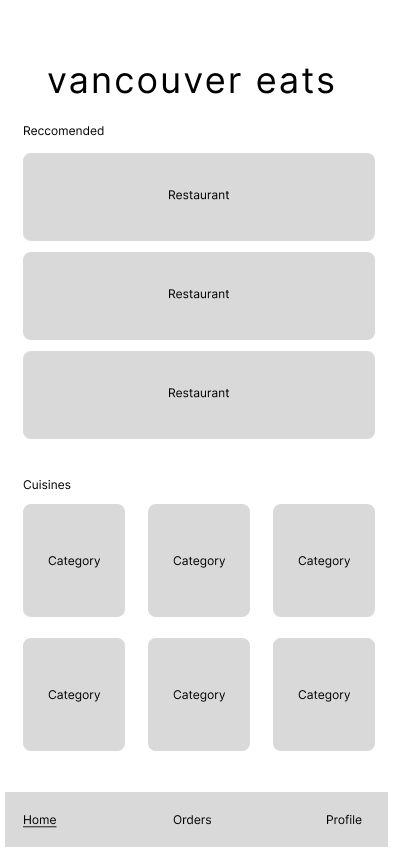
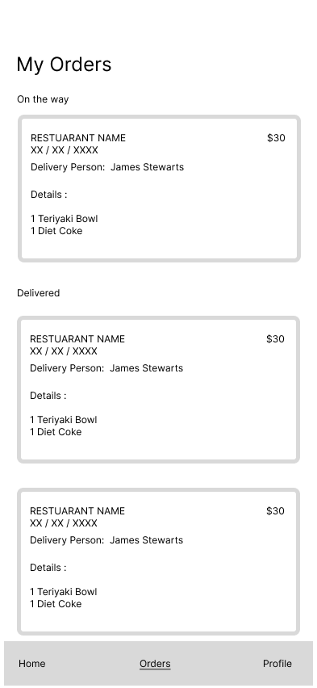
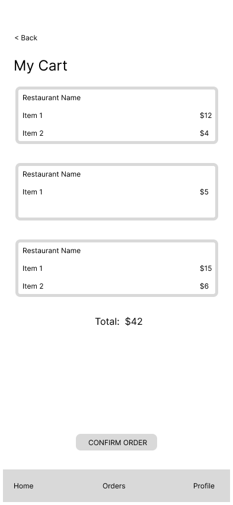
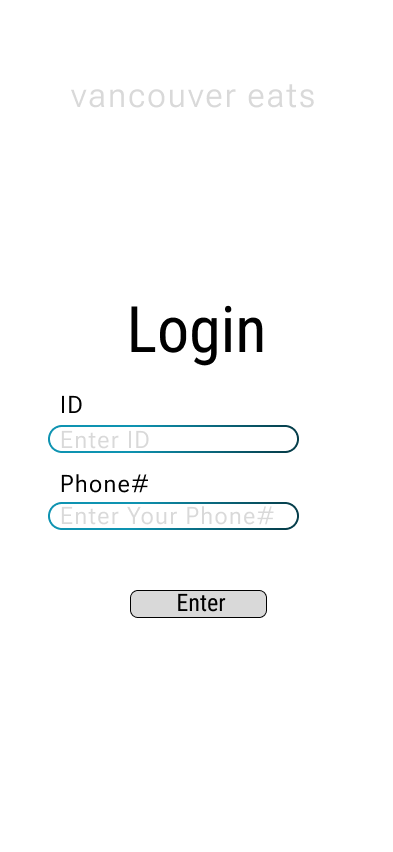

## Introduction
Our database application relates to the food and online delivery industry, specifically the management between customers, delivery drivers, and restaurants. This application intends to manage data of customers (e.g. food preferences/allergies and residing location), delivery drivers (e.g. working time and locations), and restaurants (e.g. food items and its ingredients). The emphasis is not on the retail/sales of food, but rather organizing the collection of data from the “end users” (i.e. the three mentioned above) of the industry.

For reasons in maintaining simplicity to account for the short summer course time, we have decided to keep our app local to Vancouver. Behold, Vancouver Eats!

## Tasks List
Below are the lists of tasks to do for the frontend and the backend respectively. The timeline will follow the top-down flow of the list under each of the respective subheaders with each task to be completed with an estimated time and subsequently followed by another:

### General
- [x] Set up base project - to be done ASAP, ~1 hour - Jack
    - Should have basic web application end-to-end structure
    - Should have a running server and viewable frontend upon starting application

### Frontend

- [ ] User login/register page - ~4 hours - Jack
    - Should have a page with appropriate fields for logins
    - Should have a method (whether it might be a popup or separate page) for registering a new user

- [ ] Food ordering page - ~8 hours - Joshua
    - Should be able to browse restaurants and their menus
    - Should be able to select items from the restaurant's menu and add to cart

- [ ] Order History Page - ~4 hours - Rahul
    - Should be able to view details from previous orders (order contents, total price, etc)

- [ ] Checkout Page - ~4 hours - Rahul
    - Should be able to modify items currently in a user's cart (ie. delete unwanted ones)
    - Should be able to view subtotal
    - Should be able to "checkout" / confirm an order

### Backend

- [ ] Working endpoints - ~12 hours - Everyone
    - Frontend should be able to communicate with the server via endpoints that the server is listening to
    - Designed and documented how each endpoint should behave
    - Some endpoints to implement:
        - User accounts (creating users, authorizing users)
        - Orders (creating orders, fetching orders)

- [ ] Working connection to database - ~4 hours - Jack
    - Backend should be able to communicate with the UBC Oracle servers to insert and fetch data

## Sample LoFi Wireframes
### Homepage

## Restaurant Menu

## Order History

## Cart

## Login

